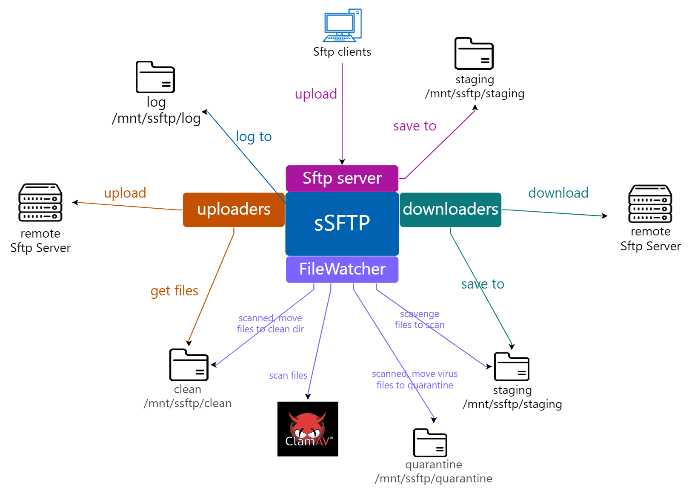
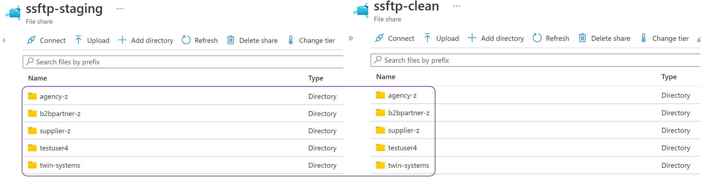
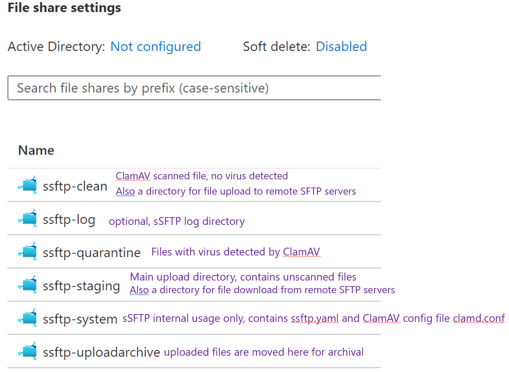
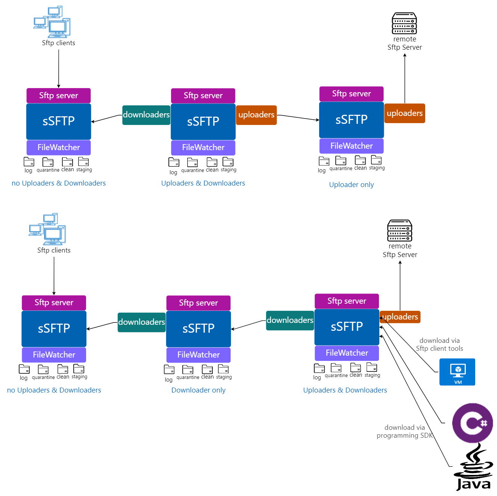
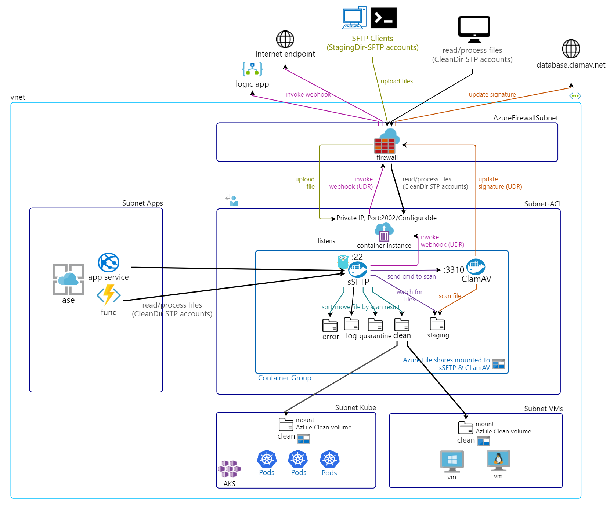
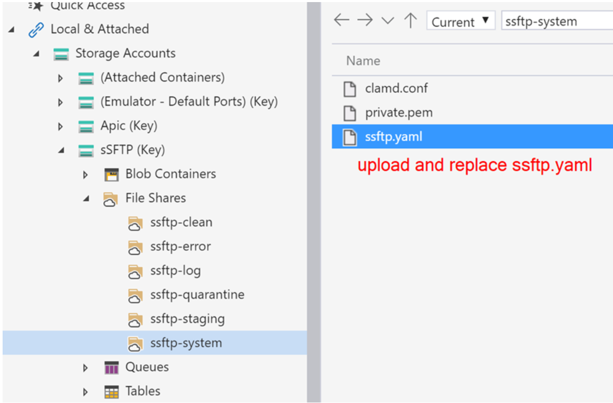
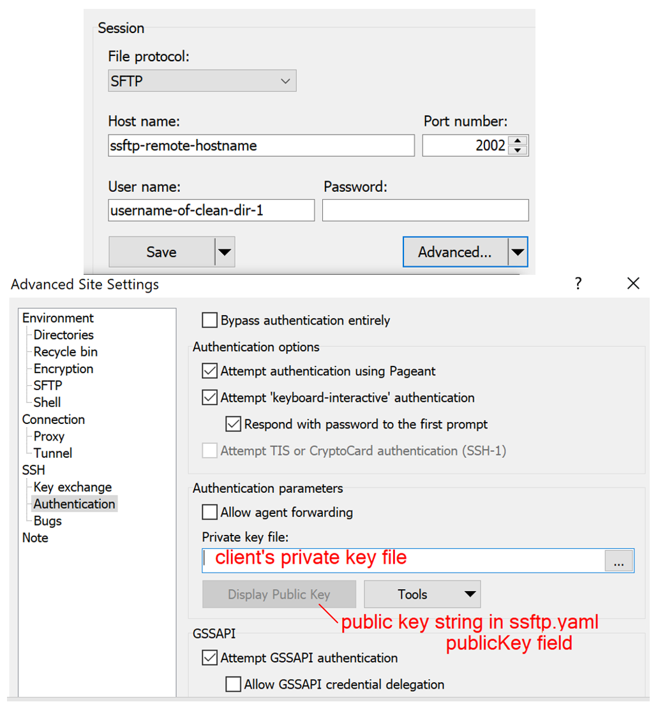
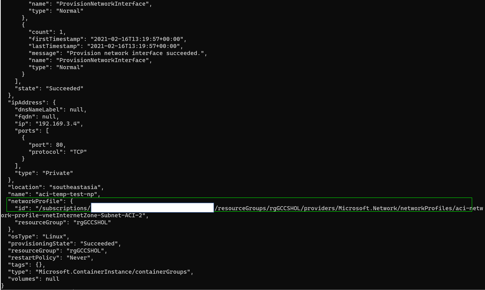
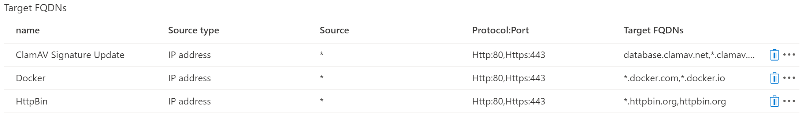

## Azure Scanned SFTP  

* [What is sSFTP](#what-is-ssftp)
* [Features](#features)
* [How Things Work - Directories & Conventions](#how-things-work---directories--conventions)
* [Chaining sSFTP & Abusing It!](#chaining-ssftp--abusing-it)
* [How Things Work - Proposed Deployment Architecture](#how-things-work---probable-deployment-model)
* [Configuring sSFTP](#configuring-ssftp)
* [Deploy sSFTP](#deploy-ssftp)
* [Webhook](#webhook)
* [Networking](#networking) 

### What is sSFTP
Azure sSFTP (Scanned SFTP) is a Go app deployed on Azure Container Instance to provide SFTP server and client services with integrated [ClamAV](https://www.clamav.net/) virus scanning and Azure File as file storage.  
sSFTP consists of 2 containers into a single Container Group namely
* [ClamAV container (by mkodockx)](https://hub.docker.com/r/mkodockx/docker-clamav/) with selfupdating of virus signature and Clamd (daemon) listening to port 3310 for virus scan commands.
* [sSFTP container](https://hub.docker.com/repository/docker/wxzd/ssftp) runs a SFTP server, watches for uploaded files, scans and sort files into appropriate mounted directories to isolate clean and virus-detected files.  

### Features  

* Container-based solution that runs on Azure Container Instance (PaaS), no infrastructure maintainence needed
* sSFTP's runs securely in Virtual Network while Internet traffic to SFTP server is proxied through Azure Firewall or Firewall of your choice
* Built-in Sftp server 
* Built-in Sftp clients to support multiple concurrent download and upload files to and from remote SFTP servers
* ClamAV virus scan on:
  * uploaded files from external Sftp clients
  * files downloaded by sSFTP Downloaders
* Supports certificate and password authentication
* Azure File as the file storage for SFTP server
* Supports [Webhook invocation](#webhook) when virus is detected
* Each Sftp login account is jailed to its configured directory only
* Configurable with a single Yaml file, config changes are recognize instantly with no container restart needed
* In the roadmap
    * Additional logging destinations like Log Analytics Workspace, Azure SQL, Azure Cosmos and more
    * Web portal to configure sSFTP in addition to current Yaml file format. Web Portal will be co-hosted within sSFTP container.

### How Things Work - Directories & Conventions  

  

* sSFTP at it's core provides a built-in Sftp server that supports multiple concurrent Sftp clients to connect and upload files.
  * Uploaded files are by design saved to <b>Staging directory(/mnt/ssftp/staging)</b>
  * FileWatcher picks up files from Staging directory and nested sub-directories and send them for ClamAV scanning
  * FileWatcher moves Virus-free files determined by ClamAV to <b>Clean directory(/mnt/ssftp/clean)</b>
  * FileWatcher moves files containing virus to <b>Quarantine directory(/mnt/ssftp/quarantine)</b>  
Above process is performed on each uploaded file.  
  
* The Downloader module are Sftp clients that downloads from remote Sftp server. You can configure multiple Downloaders through [ssftp.yaml](https://github.com/weixian-zhang/Azure-sSFTP/blob/main/deploy/ssftp.yaml) to support concurrent downloads from remote Sftp servers.  
  <b>*Downloaded files are save to Staging directory(/mnt/ssftp/staging) for FileWatcher to scan and sort.</b>
  
* Similarly to Downloaders, Uploaders are Sftp clients that uploads files to remote Sftp servers and supports multiple Uploaders running concurrently.   
  <b>*Uploaders only upload files from Clean directory(/mnt/ssftp/clean), nested directories in Clean directory are supported</b>

* FileWatcher creates the same nested sub-directory structure in Clean directory(/mnt/ssftp/staging) referencing Staging nested sub-directory structure. 
    
  
* Below explains what each sSFTP directory is used for  
    

### Chaining sSFTP & Abusing It!  

  

Apart from being a Sftp server and clients, its quite possible to chain up numerious sSFTP like laying connected jet bridges for the files to trave to their ultimate destination. Network channels between each sSFTP is secured with SSH and authentication, in addition each file is ClamAV scanned upon passing through each sSFTP instance.  

### How Things Work - Probable Deployment Model

  

* External Internet Sftp clients can download and upload files to and from sSFTP through Azure Firewall as Firewall supports Sftp protocol

* Clients from on-premise and peered-VNets can connect to sSFTP through a Private IP provided by Azure Container Instance deployed on VNet

* For ClamAV to receive signature updates and sSFTP to invoke Webhook, Route Table/UDR can be applied on sSFTP subnet to transparently route 0.0.0.0/0 to Firewall to reach any    Internet endpoints or other Azure services

* sSFTP communicates with ClamAV in an inter-process manner via TCP locahost:3310 within the same compute instance provided by Azure Container Instance

* Azure File Share ssftp-staging(/mnt/ssftp/staging) is mounted to both sSFTP and ClamAV containers so that clients can upload to same Staging directory that ClamAV reaches for scanning. 

* Downloading and processing clean files from sSFTP can be in the following ways:
    * Clean file share can be mounted to Pods in Azure Kubernetes Service and VMs
    * Clean file share can be mounted to App Service Linux
    * Azure Function deployed in App Service Environment can use any Sftp client library to connect to sSFTP through ACI Private IP
    * Daemons or jobs in VMs residing in  same or peered VNets can connect to sSFTP via ACI Private IP
    * SFTP Clients from the Internet can connect via Azure Firewall or Firewall of your choice to sSFTP via same ACI Private IP:Port and also using same "CleanDir SFTP Accounts"       to access directories in Clean file share

* Logging: currently supports logging to StdOut and files in Azure File. More log destinations coming soon...

### Configuring sSFTP  

Configurable is all done through a [single Yaml file](https://github.com/weixian-zhang/Azure-sSFTP/blob/main/deploy/ssftp.yaml).  
*ssftp.yaml must be located in mounted fileshare path as /mnt/ssftp/system/ssftp.yaml.
Update ssftp.yaml by uploading and overwriting Yaml file in ssftp-system fileshare, without restarting containers sSFTP monitors and load file changes from path: /mnt/ssftp/system/ssftp.yaml  

  

```yaml
sftpClientDownloaders:              #Downloaders are Sftp clients runs concurrently to download files from remote Sftp servers
  - name: "test.rebex.net-1"        #mandatory unique name
    host: "test.rebex.net"
    port: 22
    username: "demo"
    password: "password"
    privateKeyPath: "/mnt/ssftp/system/downloaders/rsa-putty-privatekey-authn.ppk"
    privatekeyPassphrase: "password-for-privatekey" #empty if no privatekey path is empty
    localStagingDirectory: "staging-rebex-1"  #files downloaded to "staging" directory /mnt/ssftp/staging/{localStagingDirectory}
    remoteDirectory: ""             #optional
    deleteRemoteFileAfterDownload: false
    overrideExistingFile: true
```  
* Supports multiple Sftp client Downloaders
* Downloaders save downloaded files to Staging directory /mnt/ssftp/staging
* Downloader supports both basic password and Public Key authn methods
* username - remote Sftp server login username
* password - remote Sftp server login password
* localStagingDirectory - is a sub-directory in Staging /mnt/ssftp/staging/{localStagingDirectory}
* privateKeyPath - supports Putty or PEM RSA private key file, use to authenticate against remote Sft server that requires Public Key authn
* privatekeyPassphrase - the password that secures Private Key
* remoteDirectory - Commonly, when Downloader logs-in to Sftp server, the server would have jailed this login account to a particular directory
  Unless you want to access a sub-directory under the remote jailed directory then specify the remote sub-directory name here
* deleteRemoteFileAfterDownload - sSFTP tries to delete remote file after download, throws error is permission is missing
* overrideExistingFile - true to override existing downloaded file with same file name  

```yaml
sftpClientUploaders:              #Uploaders are Sftp clients runs concurrently to upload local files to remote Sftp servers
  - name: "sftpclient-uploader-1" #mandatory unique name
    host: "100.0.10.100"
    port: 22
    username: "sftpclient-uploader-1"
    password: "password"
    privatekeyPath: null              #example: /mnt/ssftp/system/sftpclient/uploader/privatekey.ppk
    privatekeyPassphrase: null
    localDirectoryToUpload: "test.rebex.net-1" # files in this "clean" directory to be uploaded to remote Sftp
    remoteDirectory: null           #leave it empty if no remote sub dir
    overrideRemoteExistingFile: true
```  
* Supports multiple Sftp client Uploaders
* Uploaders only upload files from Clean directory /mnt/ssftp/clean
* Uploaders supports both basic password and Public Key authn methods
* username - remote Sftp server login username
* password - remote Sftp server login password
* privateKeyPath - supports Putty or PEM RSA private key file, use to authenticate against remote Sft server that requires Public Key authn
* privatekeyPassphrase - the password that secures Private Key
* localDirectoryToUpload - a sub-directory in Clean directory /mnt/ssftp/clean/{localDirectoryToUpload} that this Uploader will pick files to upload
* remoteDirectory - Commonly, when Downloader logs-in to Sftp server, the server would have jailed this login account to a particular directory
  Unless you want to access a sub-directory under the remote jailed directory then specify the remote sub-directory name here
* overrideRemoteExistingFile - true to override existing file in remote Sftp server  

```yaml
users:
  cleanDir:                         
    - directory: "clean-dir-1"
      auth:
        username: "username-of-clean-dir-1"
        password: "verycomplexpassword"
        publicKey: "ssh-rsa AAAAB3NzaC...Akgdv/+1a45V1b...jfl5..BvQ=="
```  
* cleanDir are Sftp client accounts  you can distribute to clients for them to access and download ClamAV-scanned virus free files from Clean directory /mnt/ssftp/clean 
* directory - is a sub-directory of Clean directory /mnt/ssftp/clean. This sub-directory can either be *, which means root (/mnt/ssftp/clean) or a sub-directory name.
  If *, then client upon sign-in will be directly jailed to rott directory /mnt/ssftp/clean. If sub-directory name is specified, then client upon sign-in will be jailed to /mnt/ssftp/clean/{sub directory name}.  
  cleanDir client accounts are meant for other downloader clients or daemons and batch jobs to download ClamAV-scanned virus free files for processing.  
* username - username for client to sign-in
* password - password for client to sign-in
* publicKey - supports Public Key authn, Public key string format: "ssh-rsa " + Public Key.  
  You can generate RSA key pair and paste the Public Key in this field while you securely pass the Private Key file to client for them to sign-in via Private Key. Example of WinSCP using Private Key file to sign-in to sSFTP.  
    

```yaml
stagingDir:
  - directory: "stage-dir-1" # * not supporetd, sub directory name of Staging directory /mnt/ssftp/staging/{stage-dir-1}
    auth:
      username: "stage-dir-1"
      password: "supersecure"
      publicKey: "ssh-rsa AAAAB3NzaC...Akgdv/+1a45V1b...jfl5..BvQ=="
```  
* stagingDir are Sftp client accounts you can distribute to clients for them to access and upload files to sSFTP. All uploads from this account is by default save to Staging directory /mnt/ssftp/staging
* directory - is a sub-directory in Staging directory /mnt/ssftp/staging. This is a mandatory field and * root is not supported.
* username - username for client to sign-in
* password - password for client to sign-in
* publicKey - supports Public Key authn, Public key string format: "ssh-rsa " + Public Key.  
  You can generate RSA key pair and paste the Public Key in this field while you securely pass the Private Key file to client for them to sign-in via Private Key. Example of WinSCP using Private Key file to sign-in to sSFTP.  
  
### Deploy sSFTP  
1. Prerequisites  
[Install Azure CLI](https://docs.microsoft.com/en-us/cli/azure/install-azure-cli)  

2. Create Network Profile for Azure Container Instance  

   2.1 Login to Azure  
        <code> az login </code>

   2.2 To deploy ACI into a VNet Subnet ACI needs a network profile, this network profile can then be reuse to deploy 1 or more future ACI Container Groups into the same Subnet.  
       The following command creates a temporary container instance in order to create a reusable network profile.  
        <code> az container create --resource-group <resource group> --name aci-temp-test-np --image alpine --vnet $vnetName --subnet $subnetName --restart-policy never </code>        <br />
       <br />
       Wait a moment for  "aci-temp-test-np" container to complete creation, then <b>copy network profile id</b>  
   
     
     <br />
     <br />
    2.3 Delete container "aci-temp-test-np" (we only need this container to get the network profile ID)
    <code> az container delete -g <resource group> -n aci-temp-test-np -y </code>  

3. Create Azure File shares with [azfile-createfileshare-ssftp.ps1](https://raw.githubusercontent.com/weixian-zhang/Azure-sSFTP/main/deploy/azure/azfile-createfileshare-ssftp.ps1)
   
4. Deploy sSFTP using Container Instance Yaml

    4.1 Save a copy of [sSFTP ACI Yaml file](https://raw.githubusercontent.com/weixian-zhang/Azure-sSFTP/main/deploy/aci/deploy-aci-template.yaml) as "deploy-aci.yaml".  
        Replace all < values > with comment "input", also note to <b>replace network profile id from Step 2.2</b>. 
        
    4.2 Deploy yaml file by running the following command  
        <code> az container create -g <resource group> --file .\deploy-aci.yaml </code>

### Webhook  

sSFTP supports webhook when a virus is found, HTTP POST schema below:
```json
  {
    "username": "user1",
    "scanMessage": "Win.Test.EICAR_HDB-1 FOUND",
    "filePath": "/mnt/ssftp/quarantine/v.exe",
    "timeGenerated": "Tue Mar  9 05:50:06 2021"
  }
```

### Networking  
As ACI is deployed in a Subnet, you can choose to assign a User-Defined Route (UDR) to route all outbound traffic from sSFTP to an Azure Firewall or any NextGen Firewall.  
An example of Azure Firewall Application Rule with domains whitelisted for sSFTP to work.  
Also refer to [How Things Work - Proposed Deployment Architecture](#how-things-work---proposed-deployment-architecture).
<br />
  
<br />
<br />
