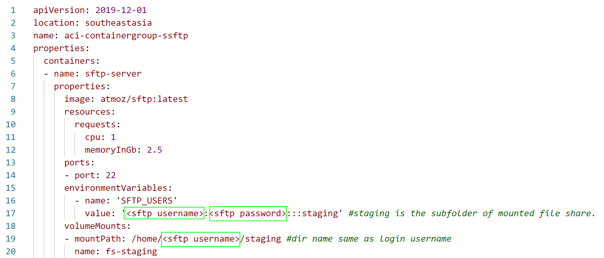
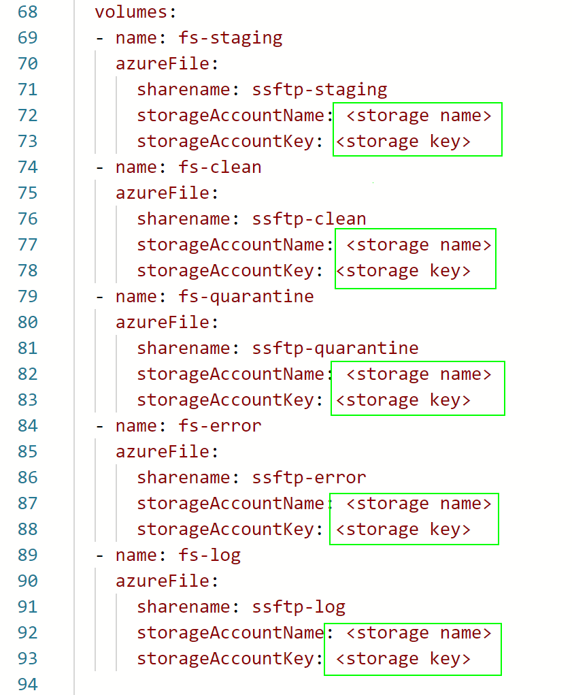
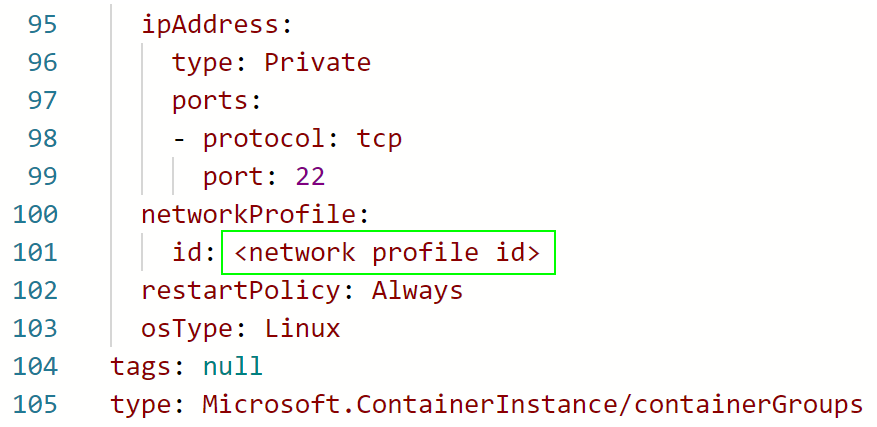

## Azure Scanned SFTP  

* [What is sSFTP](#what-is-ssftp)
* [Features](#features)
* [AzFile, Folder Structure & Conventions](#azure-file,-folder-structure-&-cConventions)
* [Configuring sSFTP](#configuring-ssftp)
* [Deploy sSFTP](#deploy-ssftp)
* [Networking](#networking) 
* [How it works](#behind-the-scenes-how-ssftp-works)

### What is sSFTP
Azure sSFTP (Scanned SFTP) is a PaaS solution thats provides SFTP server with integrated [ClamAV](https://www.clamav.net/) virus scanning and Azure File as the file storage.  
sSFTP leverages Azure Container Instance to host 2 containers into a single Container Group namely
* [ClamAV (by mkodockx) container](https://hub.docker.com/r/mkodockx/docker-clamav/) with selfupdating of virus signature and Clamd (daemon) listening to port 3310 for virus scan commands.
* [sSFTP container](https://hub.docker.com/repository/docker/wxzd/ssftp) runs a SFTP server, watches for uploaded files, scans and sort files into appropriate mounted directories to isolate clean and virus-detected files.  

### Features  

* Pure PaaS solution, sSFTP runs on Azure Container Instance
* sSFTP's Container Instance runs in Virtual Network while Internet traffic to SFTP server is proxied through Azure Firewall or Firewall of your choice
* SFTP server integrated, no separate product license needed
* ClamAV virus scan integrated
* Azure File as the file storage for SFTP server
* Each SFTP user/service login account is rooted to his or her configured directory only
* Supports multi-user/service accounts per each root directory
* Add or remove user/service accounts without restarting SFTP server
* Easy configuration using a single Yaml file
* Yaml config changes is recognized on-the-fly with no restart needed
* For whatever reason if sSFTP's Container Instance is restarted or removed, files are still retained in Azure File

This solution favors deploying Container Instance into VNet-Subnet, SFTP server can be exposed to the public Internet through Azure Firewall or any NextGen Firewall  

### Azure File, Folder Structure & Conventions

### Configuring sSFTP  

### Deploy sSFTP  
1. Prerequisites  
[Install Azure CLI](https://docs.microsoft.com/en-us/cli/azure/install-azure-cli)  

2. Create Network Profile for Azure Container Instance  

   2.1 Login to Azure  
        <code> az login </code>

   2.2 To deploy ACI into a VNet Subnet ACI needs a network profile, this network profile can then be reuse to deploy 1 or more future ACI Container Groups into the same Subnet.  
       The following command creates a temporary container instance in order to create a reusable network profile.  
        <code> az container create --resource-group <resource group> --name aci-temp-test-np --image alpine --vnet $vnetName --subnet $subnetName --restart-policy never </code>         
        
       Wait a moment for  "aci-temp-test-np" container to complete creation, then copy the <b>network profile id</b>  
   
     
      
      
    2.3 Delete container "aci-temp-test-np"
    <code> az container delete -g <resource group> -n aci-temp-test-np -y </code>  
   
3. Deploy sSFTP using Container Instance Yaml

    3.1 Save a copy of [sSFTP ACI Yaml file](https://raw.githubusercontent.com/weixian-zhang/Azure-sSFTP/main/deploy/deploy-aci-template.yaml) as "deploy-aci.yaml".  
        Replace all < values > in this file and save the file. Refer to the following screenshots.  
        
        
       
      
       
       
      Webhook Url is optional.  
      Once sSFTP detects virus in a file, this Wwebhook Url is invoked which allows sSFTP to integrate with Azure Logic App, Function and custom apps for many other possibilities.
       
       
        
       
        
       
        
        
    3.2 Deploy yaml file by running the following command  
        <code> az container create -g <resource group> --file .\deploy-aci.yaml </code>

### Networking  
As ACI is deployed in a Subnet, you can choose to assign a User-Defined Route (UDR) to route all outbound traffic from sSFTP to an Azure Firewall or any NextGen Firewall.  
An example of Azure Firewall Application Rule with domains whitelisted for sSFTP to work.  
Also refer to [How it works](#behind-the-scenes-how-ssftp-works) for more details.  
 
  
 
 

### How sSFTP Works

